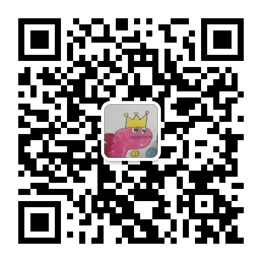

# Carla Sim - Carla 仿真 + ROS1 + 感知相关算法实战

> 感知仿真系列教程配套代码
> 公众号：感知技术life

---

## 项目简介

基于 **Carla 仿真环境 + ROS1 + 感知相关算法实战** 的感知实战系列，从环境搭建到目标检测、BEV拼接、语义分割，一步步带你跑通完整的感知数据流。

## 系列教程（1-6期）

| 章节 | 内容 | 状态 |
|:----|:-----|:----:|
| 01 | Carla + ROS 仿真环境搭建 | 已完成 |
| 02 | 添加 NPC 交通流 | 已完成 |
| 03 | YOLOv8 目标检测（TCP跨环境通信） | 已完成 |
| 04 | Tesla 四路相机安装 | 已完成 |
| 05 | 四路相机标定与 BEV 拼接 | 已完成 |
| 06 | 实时语义分割（SegFormer / YOLOPv2） | 已完成 |

## 环境要求
- Ubuntu 22.04
- Docker
- Nvidia GPU

## 快速开始

```bash
# 1. 克隆仓库
git clone https://gitee.com/buffalo891/carla_sim.git
cd carla_sim

# 2. 启动容器
bash docker/scripts/dev_start.sh
bash docker/scripts/dev_into.sh

# 3. 启动 Carla UE4
bash ./CarlaUe4.sh
```

详细步骤见 `docs/` 目录下各期文档。

## 目录结构

```
carla_sim/
├── docker/scripts/       # 容器启动脚本
├── scripts/              # Python2 辅助脚本（NPC/棋盘格）
├── tcp_bridge/           # TCP 图像传输（Py2→Py3）
├── sim_workspace/        # 算法工作区
│   ├── bev_surround/     # BEV 环视拼接
│   ├── image_detect/     # YOLOv8 目标检测
│   └── image_seg/        # 语义分割（SegFormer/YOLOPv2）
├── docs/                 # 1-6期教程文档
├── data/pictures/        # 运行截图
├── ros_bridge_ws/src/    # Carla ROS Bridge 源码
├── CarlaUe4.sh           # 启动 Carla UE4
└── ros_bridge_env.sh     # ROS 环境配置
```

## 环境与模型

- **模型权重**：由于体积较大（数百MB），不包含在仓库中，需要自行下载
  - YOLOv8: `yolov8s.pt`
  - YOLOPv2: `yolopv2.pt`
  - SegFormer: `segformer-b2-finetuned-ade-512-512`
- **Docker 镜像包**：开箱即用的完整环境为付费产品，可关注公众号获取

## 开源协议
本项目代码遵循 MIT License 开源，但**不包含任何模型权重文件**。

YOLOv8 / YOLOPv2 / SegFormer 等预训练模型版权归各自作者所有，请遵循其各自开源协议：
- YOLOv8 (ultralytics)：AGPL-3.0 协议，商用需购买商业授权或开源衍生代码
- YOLOPv2：GPL 协议
- SegFormer (NVIDIA)：Apache-2.0 / MIT

如需商业使用，请自行确认并购买相应商业授权。本项目不承担因模型使用产生的授权风险。

## 联系我们

- 公众号：感知技术life

- 技术交流群：公众号回复"社群"
- B站：https://space.bilibili.com/1990924908
