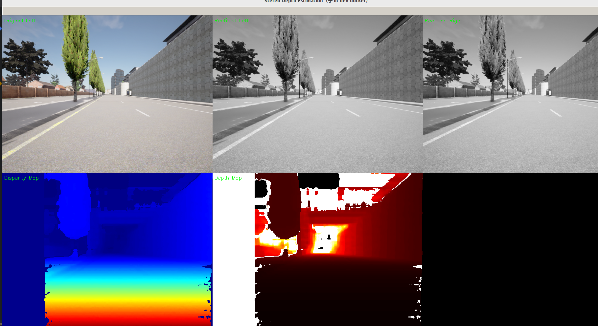
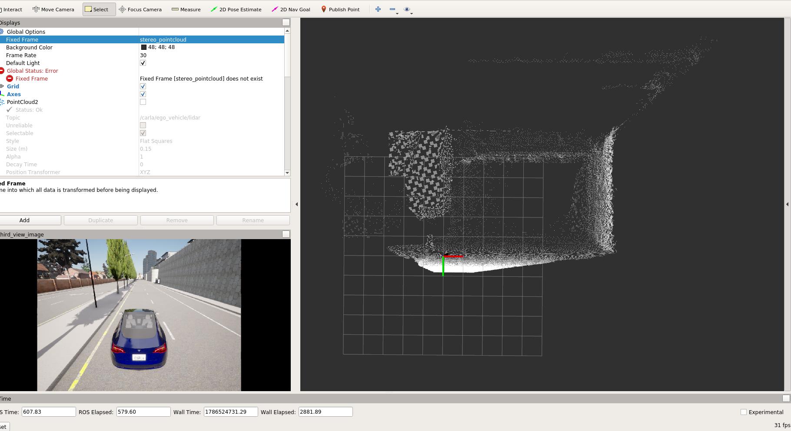

# 10_实现双目障碍物测距
# 1 启动容器

1. 启动容器
```
cd carla_sim
bash docker/scripts/dev_start.sh
```
2. 进入镜像
```
bash docker/scripts/dev_into.sh
```

# 2 启动Carla UE4

```
cd /opt/carla_ws
bash ./CarlaUe4.sh
```


# 3 添加左右双目相机
修改ros_bridge_ws/src/carla-ros-bridge/carla_spawn_objects/config/objects.json文件,添加左右双目相机，采用FOV90度相机，双目基线为0.4m
```
{
    "type": "sensor.camera.rgb",
    "id": "rgb_stereo_left",
    "spawn_point": {"x": 2.4, "y": 0.2, "z": 1.0, "roll": 0.0, "pitch": 0.0, "yaw": 0.0},
    "image_size_x": 640,
    "image_size_y": 480,
    "fov": 90.0
},
{
    "type": "sensor.camera.rgb",
    "id": "rgb_stereo_right",
    "spawn_point": {"x": 2.4, "y": -0.2, "z": 1.0, "roll": 0.0, "pitch": 0.0, "yaw": 0.0},
    "image_size_x": 640,
    "image_size_y": 480,
    "fov": 90.0
},
```
# 4 启动ros bridge car
新开一个终端
```
cd carla_sim
bash ros_bridge.sh
```


# 5 双目计算障碍物距离

新开一个终端
```
cd /opt/carla_ws/sim_workspace/stereo_distance
python stereo_distance_py2.py
```
下图是双目相机生成的视差图、深度图以及矫正后的左右图像


下图是双目相机生成的点云图
