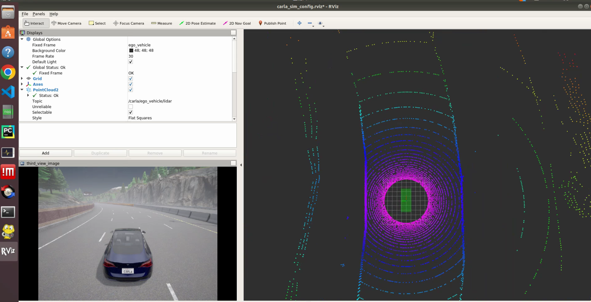

# 1_Carla+ROS仿真环境跑通
# 1 启动容器

1. 启动容器
```
cd carla_sim
bash docker/scripts/dev_start.sh
```
2. 进入镜像
```
bash docker/scripts/dev_into.sh
```

# 2 启动Carla UE4

```
cd /opt/carla_ws
bash ./CarlaUe4.sh
```


# 3 启动ros bridge car
1. 新开一个终端
```
cd carla_sim
bash docker/scripts/dev_into.sh
```
2. source ros bridge_ws环境
```
source ros_bridge_env.sh
cd /opt/carla_ws/ros_bridge_ws
source devel/setup.bash
```
3. 启动ros bridge car
```
cd /opt/carla_ws
roslaunch carla_ros_bridge carla_ros_bridge_with_example_ego_vehicle.launch
```


# 4 启动ROS RVIZ可视化
1. 新开一个终端
```
cd carla_sim    
bash docker/scripts/dev_into.sh
```
2. 启动可视化
```
cd /opt/carla_ws
rosrun rviz rviz -d carla_sim_config.rviz
```
