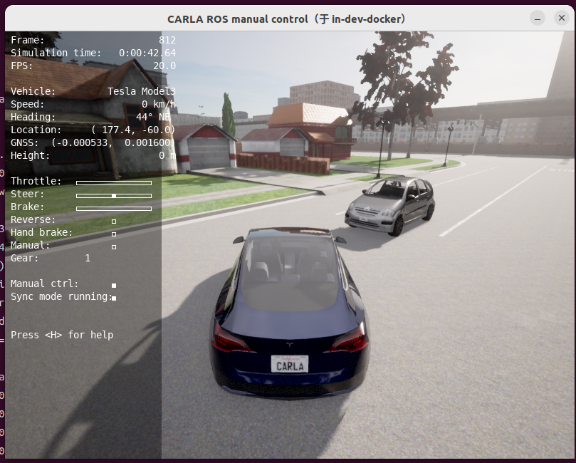
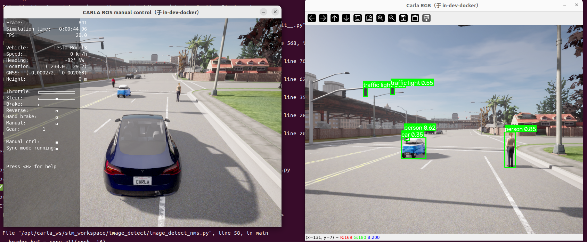

# 3_获取相机图像做Yolov8目标检测
# 1 启动容器

1. 启动容器
```
cd carla_sim
bash docker/scripts/dev_start.sh
```
2. 进入镜像
```
bash docker/scripts/dev_into.sh
```

# 2 启动Carla UE4

```
cd /opt/carla_ws
bash ./CarlaUe4.sh
```


# 3 启动ros bridge car
1. 新开一个终端
```
cd carla_sim
bash docker/scripts/dev_into.sh
```
2. source ros bridge_ws环境
```
source ros_bridge_env.sh
cd /opt/carla_ws/ros_bridge_ws
source devel/setup.bash
```
3. 启动ros bridge car
```
cd /opt/carla_ws
roslaunch carla_ros_bridge carla_ros_bridge_with_example_ego_vehicle.launch
```


# 4 添加NPC到仿真环境
1. 新开一个终端
```
cd carla_sim    
bash docker/scripts/dev_into.sh
```
2. 启动可视化
```
cd /opt/carla_ws
python scripts/spawn_random_npc.py # 默认添加10个车5个人
python scripts/spawn_random_npc.py _vehicle_count:=20 _walker_count:=10 #自定义添加
```


# 5 获取相机图像并进行Yolov8目标检测
这个地方比较麻烦的是怎么把ros的python2.7环境的图像数据发给python3.10环境，因为要跑Yolov8模型需要用python3。考虑了两种方法，这两种都实现了：
## 方案一：rosbridge_server+roslibpy的方案
1. 启动rosbridge_server
新开一个终端
```
cd /opt/carla_ws
roslaunch rosbridge_server rosbridge_websocket.launch queue_size:=1 port:=9099
```
2. 启动roslibpy接受图像数据
新开一个终端
```
source activate py310
cd /opt/carla_ws/sim_workspace/image_detect
python rosbridge_roslib.py
```
缺点：延迟太大，还有丢帧严重。

## 方案二：采用TCP直接发送图像数据的方案（推荐）
1. ros相机图像转到python3.10环境中
新开一个终端
```
#ros图像转tcp消息
cd /opt/carla_ws
python tcp_bridge/tcp_bridge_server.py # 启动tcp bridge server
```

2. 从python3.10环境中接收tcp消息,并执行Yolov8目标检测
新开一个终端
```
cd /opt/carla_ws/sim_workspace/image_detect
#接收tcp消息,并执行目标检测
python image_detect_nms.py
```
