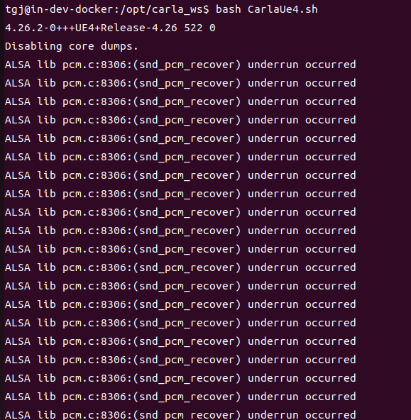
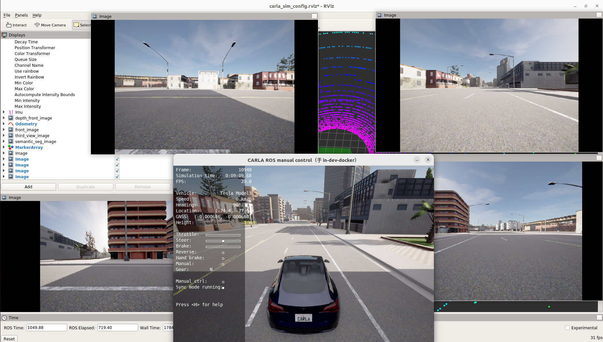
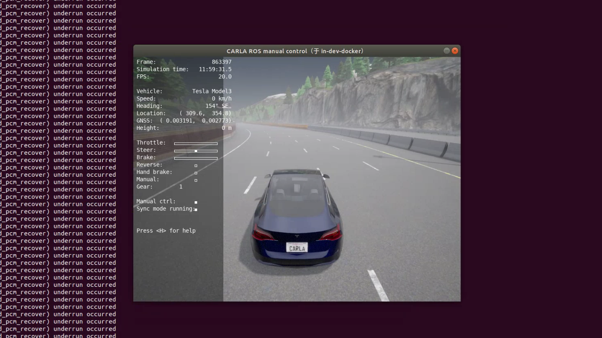
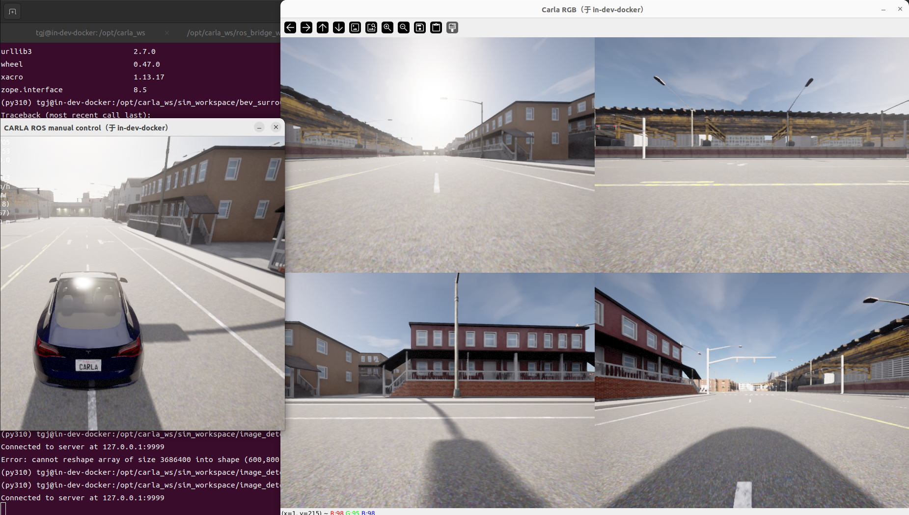
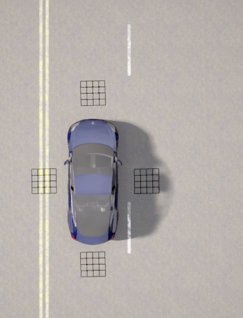

# 4_Tesla安装4个摄像头并创建网格
# 1 启动容器

1. 启动容器
```
cd carla_sim
bash docker/scripts/dev_start.sh
```
2. 进入镜像
```
bash docker/scripts/dev_into.sh
```

# 2 启动Carla UE4

```
cd /opt/carla_ws
bash ./CarlaUe4.sh
```


# 3 安装4个摄像头到Tesla上前后左右
tesla 尺寸：4.6 × 1.84 × 1.44 m
ros_bridge_ws/src/carla-ros-bridge/carla_spawn_objects/config/objects.json 中的sensors 配置如下（安装的坐标系采用右手坐标系）：
```json
{
    "type": "sensor.camera.rgb",
    "id": "rgb_front", #前相机
    "spawn_point": {"x": 2.3, "y": 0.0, "z": 0.8, "roll": 0.0, "pitch": 0.0, "yaw": 0.0},
    "image_size_x": 640,
    "image_size_y": 480,
    "fov": 120.0
},
{
    "type": "sensor.camera.rgb",
    "id": "rgb_back", #后相机
    "spawn_point": {"x": -2.3, "y": 0.0, "z": 0.8, "roll": 0.0, "pitch": 0.0, "yaw": 180.0}, # 后相机安装在后方，yaw正方向旋转180度
    "image_size_x": 640,
    "image_size_y": 480,
    "fov": 120.0
},
{
    "type": "sensor.camera.rgb",
    "id": "rgb_left", #左相机
    "spawn_point": {"x": 0.0, "y": 0.92, "z": 0.8, "roll": 0.0, "pitch": 0.0, "yaw": 90.0}, # 左相机安装在左方，yaw正方向旋转90度
    "image_size_x": 640,
    "image_size_y": 480,
    "fov": 120.0
},
{
    "type": "sensor.camera.rgb",
    "id": "rgb_right", #右相机
    "spawn_point": {"x": 0.0, "y": -0.92, "z": 0.8, "roll": 0.0, "pitch": 0.0, "yaw": -90.0}, # 右相机安装在右方，yaw负方向旋转90度
    "image_size_x": 640,
    "image_size_y": 480,
    "fov": 120.0
},
```

# 4 启动ros bridge car
1. 新开一个终端
```
cd carla_sim
bash docker/scripts/dev_into.sh
```
2. source ros bridge_ws环境
```
source ros_bridge_env.sh
cd /opt/carla_ws/ros_bridge_ws
source devel/setup.bash
```
3. 启动ros bridge car
```
cd /opt/carla_ws
roslaunch carla_ros_bridge carla_ros_bridge_with_example_ego_vehicle.launch
```


# 5 获取相机图像
1. ros相机图像转到python3.10环境中
新开一个终端
```
#ros图像转tcp消息
cd /opt/carla_ws
python tcp_bridge/tcp_bridge_server_multi_camera_py2.py # 启动tcp bridge server
```
2. 接收tcp图像消息
新开一个终端
```
source activate py310
cd /opt/carla_ws/sim_workspace/image_detect
python tcp_bridge_client_py3.py
```


# 6 创建棋盘格
新开一个终端
```
# vehicle-id 是车辆的id，在创建ego_vehicle时会有打印输出
python scripts/create_board_py2.py --vehicle-id 513
```

