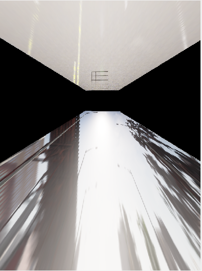
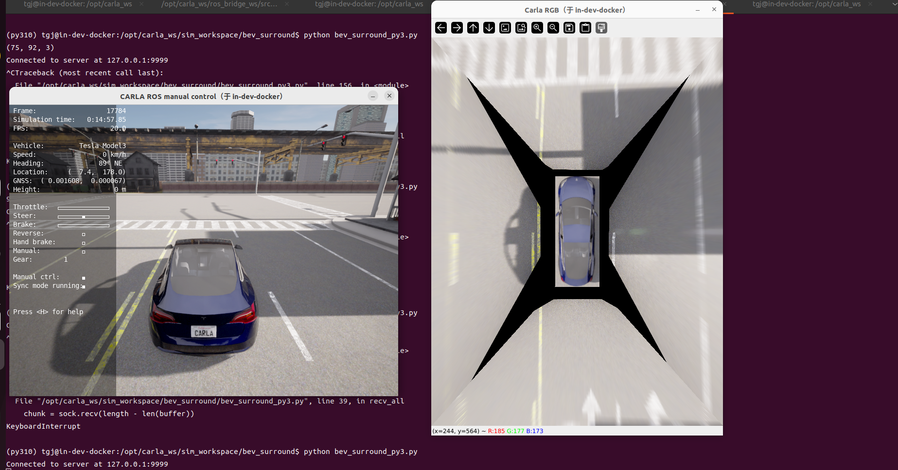

# 5_4个摄像头的标定和bev拼接
# 1 启动容器

1. 启动容器
```
cd carla_sim
bash docker/scripts/dev_start.sh
```
2. 进入镜像
```
bash docker/scripts/dev_into.sh
```

# 2 启动Carla UE4

```
cd /opt/carla_ws
bash ./CarlaUe4.sh
```


# 3 启动ros bridge car
1. 新开一个终端
```
cd carla_sim
bash docker/scripts/dev_into.sh
```
2. source ros bridge_ws环境
```
source ros_bridge_env.sh
cd /opt/carla_ws/ros_bridge_ws
source devel/setup.bash
```
3. 启动ros bridge car
```
cd /opt/carla_ws
roslaunch carla_ros_bridge carla_ros_bridge_with_example_ego_vehicle.launch
```


# 4 获取相机图像
1. ros相机图像转到python3.10环境中
新开一个终端
```
#ros图像转tcp消息
cd /opt/carla_ws
python tcp_bridge/tcp_bridge_server_multi_camera_py2.py # 启动tcp bridge server
```
2. 接收tcp图像消息
新开一个终端
```
source activate py310
cd /opt/carla_ws/sim_workspace/image_detect
python tcp_bridge_client_py3.py
```


# 5 创建棋盘格
新开一个终端
```
# vehicle-id 是车辆的id，在创建ego_vehicle时会有打印输出
python scripts/create_board_py2.py --vehicle-id 513
```


# 6 相机标定H矩阵
新开一个终端
```
cd /opt/carla_ws/sim_workspace/bev_surround
source activate py310
# name 是标定哪个相机，【front、back、left、right】
python camera_bev_calib_py3.py --name front
```


# 7 bev拼接
新开一个终端
```
cd /opt/carla_ws/sim_workspace/bev_surround
source activate py310
python bev_surround_py3.py
```
