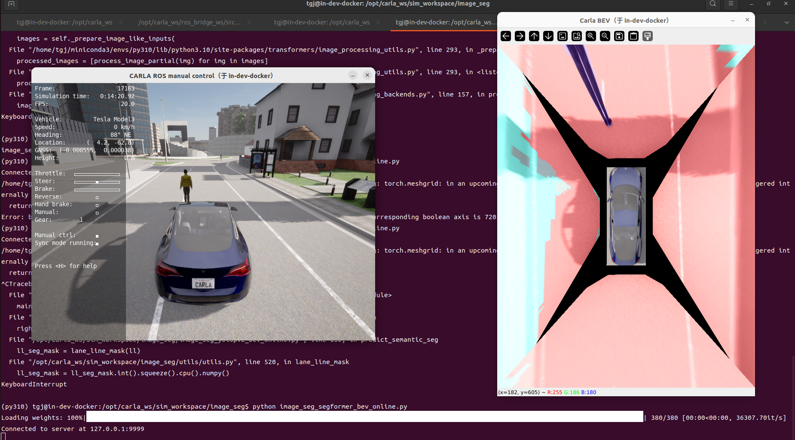
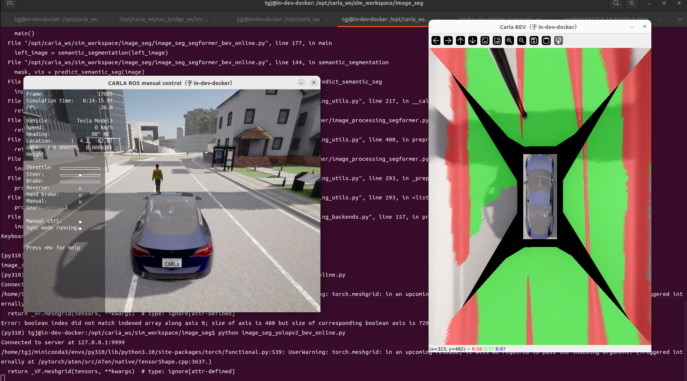

# 7_BEV+语义分割的融合
# 1 启动容器

1. 启动容器
```
cd carla_sim
bash docker/scripts/dev_start.sh
```
2. 进入镜像
```
bash docker/scripts/dev_into.sh
```

# 2 启动Carla UE4

```
cd /opt/carla_ws
bash ./CarlaUe4.sh
```


# 3 启动ros bridge car
1. 新开一个终端
```
cd carla_sim
bash docker/scripts/dev_into.sh
```
2. source ros bridge_ws环境
```
source ros_bridge_env.sh
cd /opt/carla_ws/ros_bridge_ws
source devel/setup.bash
```
3. 启动ros bridge car
```
cd /opt/carla_ws
roslaunch carla_ros_bridge carla_ros_bridge_with_example_ego_vehicle.launch
```


# 4 发布相机图像
新开一个终端
```
#ros图像转tcp消息
cd /opt/carla_ws
python tcp_bridge/tcp_bridge_server_multi_camera_py2.py # 启动环视四路相机发布

python tcp_bridge/tcp_bridge_server_py2.py # 只启动前视相机发布
```
# 5 启动语义BEV
新开一个终端
1.采用segformer+BEV
```
cd /opt/carla_ws/sim_workspace/image_seg

python image_seg_segformer_bev_online.py #在线实时语义分割
```



2.采用yolopv2+BEV
```
cd /opt/carla_ws/sim_workspace/image_seg

python image_seg_yolopv2_bev_online.py #在线实时语义分割
```

