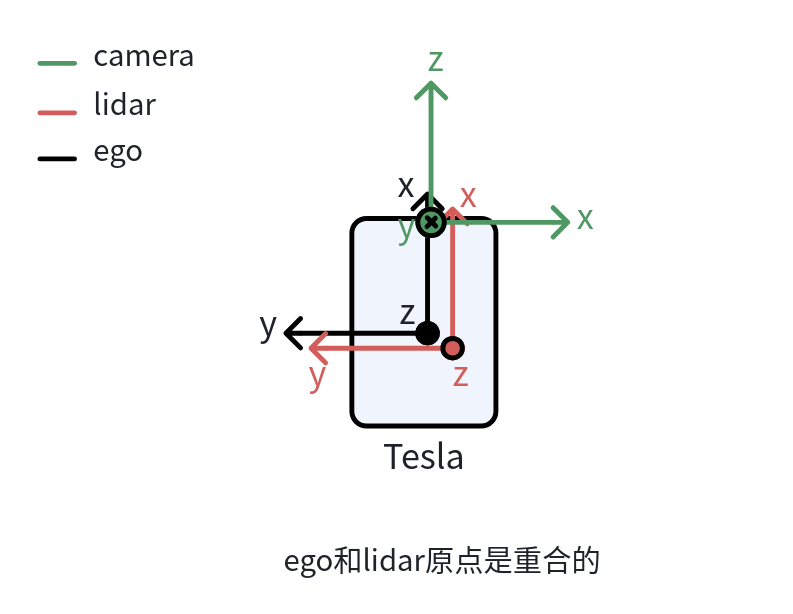
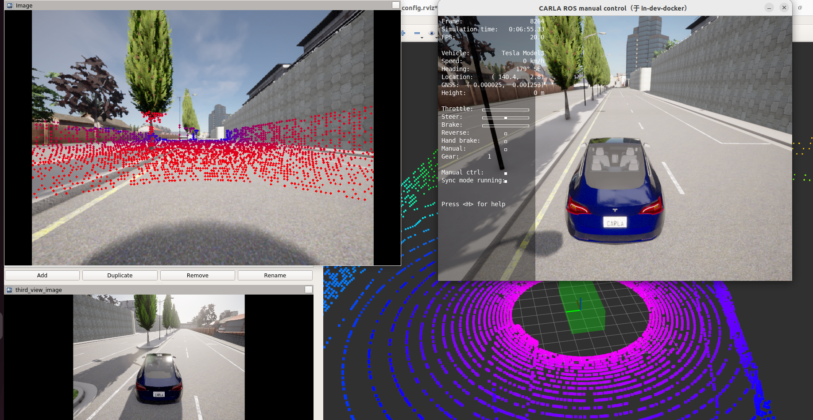

# 8_实现点云和图像的融合
# 1 启动容器

1. 启动容器
```
cd carla_sim
bash docker/scripts/dev_start.sh
```
2. 进入镜像
```
bash docker/scripts/dev_into.sh
```

# 2 启动Carla UE4

```
cd /opt/carla_ws
bash ./CarlaUe4.sh
```


# 3 启动ros bridge car
1. 新开一个终端
```
cd carla_sim
bash docker/scripts/dev_into.sh
```
2. source ros bridge_ws环境
```
source ros_bridge_env.sh
cd /opt/carla_ws/ros_bridge_ws
source devel/setup.bash
```
3. 启动ros bridge car
```
cd /opt/carla_ws
roslaunch carla_ros_bridge carla_ros_bridge_with_example_ego_vehicle.launch
```


# 4 图像、点云和自车坐标系转换
图中黑色框表示自车坐标系，红色框表示激光雷达坐标系，绿色框表示相机坐标系。ego和lidar坐标系原点是重合的，只是为了方便可视化，把lidar的摞了一点。


**相机相对于自车的外参：**
```
transforms:
  -
    header:
      seq: 0
      stamp:
        secs: 11
        nsecs:  41401547
      frame_id: "ego_vehicle"
    child_frame_id: "ego_vehicle/rgb_main_front"
    transform:
      translation:
        x: 2.4
        y: 0.0
        z: 1.0
      rotation:
        x: -0.5
        y: 0.5
        z: -0.5
        w: 0.5
---

```
**激光雷达相对于自车的外参：**
```
transforms:
  -
    header:
      seq: 0
      stamp:
        secs: 11
        nsecs:  41401547
      frame_id: "ego_vehicle"
    child_frame_id: "ego_vehicle/lidar"
    transform:
      translation:
        x: 0.0
        y: 0.0
        z: 2.4
      rotation:
        x: 0.0
        y: 0.0
        z: 0.0
        w: 1.0

```
# 5 图像和点云融合
新开一个终端
```
#ros图像转tcp消息
cd /opt/carla_ws/sim_workspace/image_pointcloud
python image_pointcloud_fusion_py2.py #前视相机和激光雷达点云融合
```
新开一个终端
```
rosrun rviz rviz -d carla_sim_config.rviz #查看投影结果
```

**基本步骤：**
1.点云转到相机坐标系
```
T_ego_camera = self.homo_transform_inv(T_camera_ego)
T_lidar_camera = np.dot(T_ego_camera, T_lidar_ego)

```
2.再通过K矩阵转到图像坐标系
```
# 投影到图像平面 (针孔模型)
# p_image = K * P_camera
points_proj = np.dot(self.camera_matrix, points_valid.T).T

```
3.除以Z坐标，得到归一化后的像素坐标系
```
# 归一化
u = points_proj[:, 0] / points_proj[:, 2]
v = points_proj[:, 1] / points_proj[:, 2]
```
4.在图像上画圆可视化

