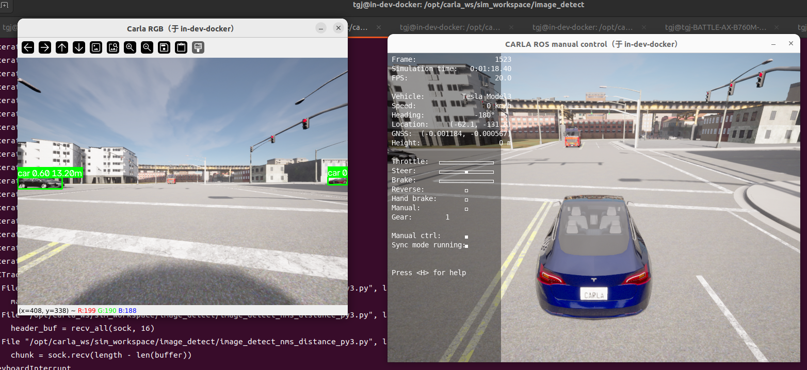
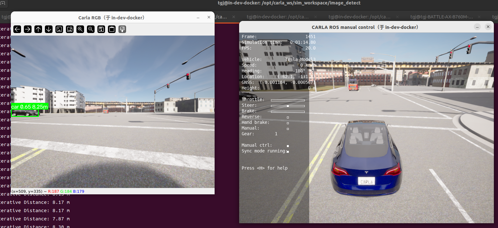

# 9_实现单目障碍物测距
# 1 启动容器

1. 启动容器
```
cd carla_sim
bash docker/scripts/dev_start.sh
```
2. 进入镜像
```
bash docker/scripts/dev_into.sh
```

# 2 启动Carla UE4

```
cd /opt/carla_ws
bash ./CarlaUe4.sh
```


# 3 启动ros bridge car
1. 新开一个终端
```
cd carla_sim
bash docker/scripts/dev_into.sh
```
2. source ros bridge_ws环境
```
source ros_bridge_env.sh
cd /opt/carla_ws/ros_bridge_ws
source devel/setup.bash
```
3. 启动ros bridge car
```
cd /opt/carla_ws
roslaunch carla_ros_bridge carla_ros_bridge_with_example_ego_vehicle.launch
```

# 4 发布相机图像
新开一个终端
```
#ros图像转tcp消息
cd /opt/carla_ws
python tcp_bridge/tcp_bridge_server_py2.py # 只启动前视相机发布
```

# 5 创建NPC
新开一个终端
```
python scripts/spawn_random_npc_py2.py _vehicle_count:=20 _walker_count:=10 #自定义添加数量
```


# 6 障碍物检测及测距
单目障碍物的测距主要方法有：
## 6.1 地平面假设方法
假设地面是**平面**，且已知相机相对地面的高度和姿态，那么图像中的每个像素点，通过相机内参和外参，都可以投影到世界坐标系中的地平面（Z=0）上，从而算出距离。
| 要素 | 说明 |
|:----|:------|
| 前提 | 地面是平面、相机高度和姿态已知 |
| 优点 | 计算简单、实时性好（纯几何） |
| 缺点 | 地面不平（坡道）就错；目标底部被遮挡时测距误差大 |

**应用场景**
- 前方车辆测距（利用车辆底部着地点）
- 车道线距离估计
- 平直道路场景

## 6.2 迭代投影方法
不假设地面是平的，而是**迭代搜索**最优的物体深度值：把物体的3D假设投影回图像，与检测框/特征比对，不断调整深度直到投影结果匹配。
| 要素 | 说明 |
|:----|:------|
| 前提 | 知道物体的**真实3D尺寸**（车辆宽1.8m等） |
| 原理 | 投影-比对-迭代收敛 |
| 优点 | 不需要地面假设，对坡道鲁棒 |
| 缺点 | 依赖先验尺寸；迭代耗时；远距离误差大 |

**应用场景**
- 已知尺寸的物体测距（车辆、行人、路牌）
- 配合检测框回归出3D信息的场景

## 6.3 点云融合图像方法
**单目图像 + 稀疏点云**（如激光雷达或双目视差图）融合：用点云提供准确的深度锚点，图像提供稠密的语义和边界信息。
| 要素 | 说明 |
|:----|:------|
| 前提 | 相机与激光雷达标定好（外参）、时间同步 |
| 核心 | 点云投影到图像，取其深度 |
| 优点 | 距离准确，不受光照影响 |
| 缺点 | 依赖传感器融合标定；稀疏点云远处覆盖不足 |

**应用场景**
- 自动驾驶主流的"相机+激光雷达"融合方案

## 6.4 单目深度估计方法
直接用深度学习模型，从**单张图像**回归出每个像素的深度值——让网络"学会"从视觉线索（透视、遮挡、纹理梯度、先验）推断距离。

| 要素 | 说明 |
|:----|:------|
| 核心 | 网络学习深度先验（透视、遮挡、大小） |
| 优点 | 稠密深度、无需传感器、成本低 |
| 缺点 | 绝对精度差；泛化依赖训练数据；远距离误差大 |

**应用场景**
- 稠密深度估计、场景重建
- 作为辅助信息（结合检测框取目标区域深度均值）
- 新兴的Depth Anything等模型效果好

## 6.5 测试
新开一个终端
```
cd /opt/carla_ws/sim_workspace/image_detect
#接收tcp消息,并执行目标检测及测距
python image_detect_nms_distance_py3.py --mode 1/3

mode:
1: 地平面假设方法
3: 迭代测距方法
```
**地平面假设方法**


**迭代测距方法**

